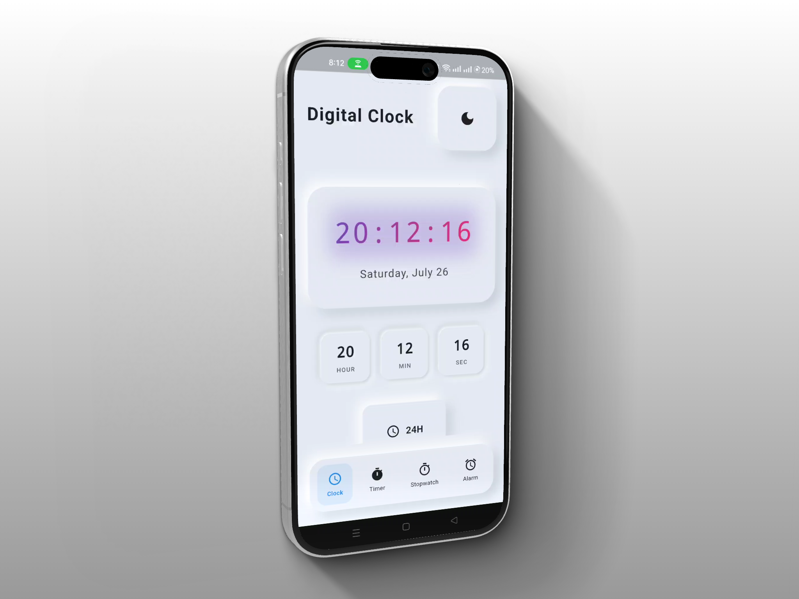
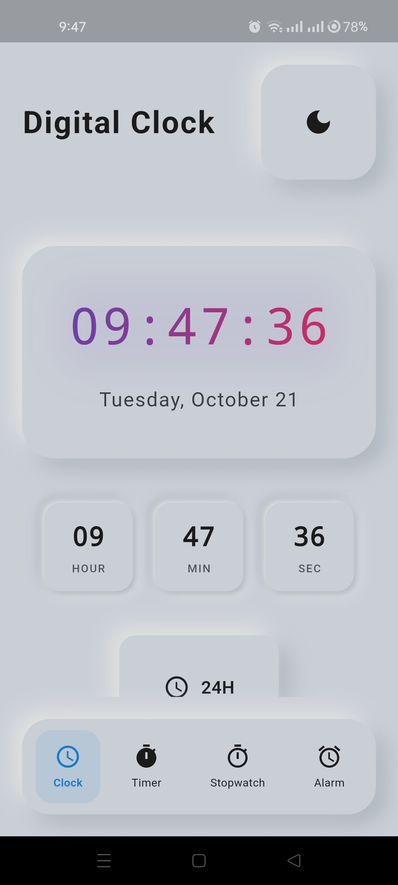
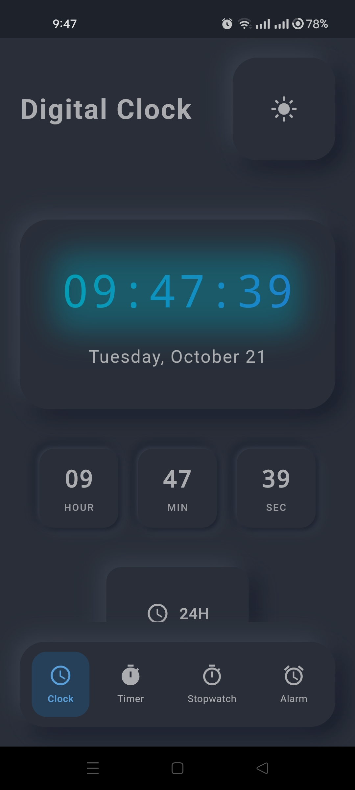
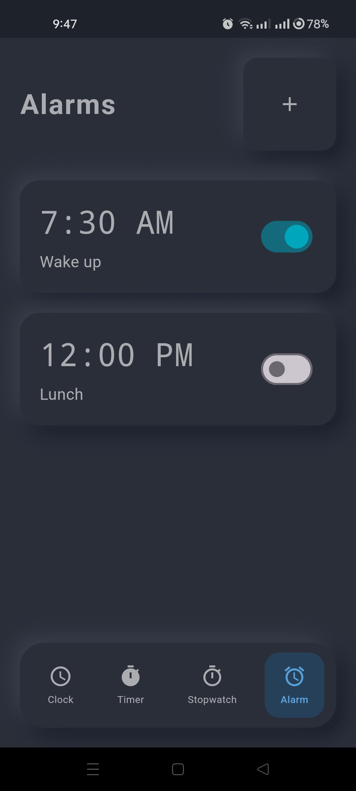
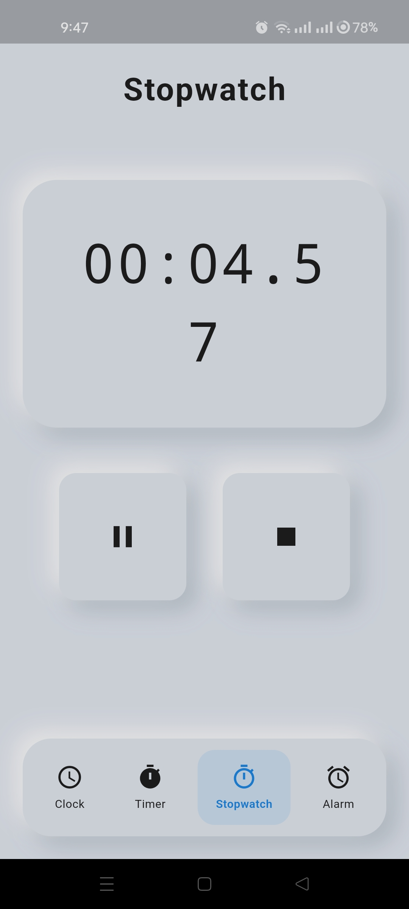

# 🕒 Neuromorphism Digital Clock

[](https://flutter.dev)
[](https://dart.dev)
[]()
[](https://opensource.org/)
[](LICENSE)

---

## 🧠 Overview

**Neuromorphism Digital Clock** is a **beginner-friendly yet visually captivating Flutter project** that demonstrates the **neuromorphic design aesthetic** — blending soft shadows, light surfaces, and subtle depth to create a realistic 3D interface.

This project serves as a **hands-on learning resource** for developers and designers exploring Flutter's design capabilities, custom UI elements, and animation principles.

---

## 🎬 Preview

<div align="center">
  
  
    
</div>


## ✨ Features

* 🕒 **Real-Time Clock Display** — Continuously updating digital time display.
* 🌗 **Neuromorphic UI Design** — Soft, elegant shadows for a realistic 3D effect.
* ⚡ **Smooth Animations** — Subtle transitions enhance visual appeal.
* 🧩 **Light & Dark Mode Support** — Seamlessly switch between modern themes.
* 📱 **Cross-Platform** — Works beautifully on Android, iOS, Web, and Desktop.

---

## 📸 Screenshots

<div align="left">
  <table>
    <tr>
      <td></td>
      <td></td>
      <td></td>
      <td></td>
    </tr>
  </table>
</div>

---

## 🎥 Demo Video

Watch the **Neuromorphism Digital Clock** in action on **X (formerly Twitter):**
👉 [Watch the Demo Here](https://x.com/KishanP07684084/status/1949116612566552703)

---

## 🏗️ Tech Stack

| Technology                          | Description                                          |
| ----------------------------------- | ---------------------------------------------------- |
| **Flutter**                         | Cross-platform framework for building beautiful apps |
| **Dart**                            | Core programming language powering Flutter apps      |
| **CustomPainter & Animation**       | Used for rendering and dynamic effects               |
| **Material Design + Neuromorphism** | Blends modern and soft 3D design principles          |

---

## ⚙️ Installation & Setup

Follow these steps to run the project locally:

### 1️⃣ Clone the Repository

```bash
git clone https://github.com/<your-username>/Neuromorphism-Digital-Clock.git
cd Neuromorphism-Digital-Clock
```

### 2️⃣ Install Dependencies

```bash
flutter pub get
```

### 3️⃣ Run the App

```bash
flutter run
```

---

## 💡 Learning Outcomes

By working with this project, you'll gain insights into:

* Building **custom Flutter UIs** with a neuromorphic touch
* Applying **shadow depth and lighting principles**
* Using **animations** to enhance user experience
* Structuring small yet effective **Flutter UI projects**

---

## 🤝 Contributing

Contributions are encouraged! If you’d like to enhance the design or functionality:

1. Fork the repository
2. Create a new branch (`git checkout -b feature/your-feature`)
3. Commit your changes (`git commit -m 'Add a new feature'`)
4. Push to the branch (`git push origin feature/your-feature`)
5. Open a Pull Request

---
🧠 Flutter Development Environment Setup

This project is built using Flutter. Below are the essential details and configuration requirements for replicating the development environment.

| Component              | Details                                      |
| ---------------------- | -------------------------------------------- |
| **Flutter Version**    | 3.27.1 (Stable Channel)                      |
| **Framework Revision** | 17025dd882                                   |
| **Engine Revision**    | cb4b5fff73                                   |
| **Dart Version**       | 3.6.0                                        |
| **DevTools Version**   | 2.40.2                                       |
| **Operating System**   | Windows 10 (Version 10.0.26200.6725, 64-bit) |
| **Locale**             | en-US                                        |


💻 Android Studio

* Version: 2023.3
* Java Runtime: OpenJDK 17 (17.0.10+0--11572160)


## 🪪 License

This project is licensed under the **MIT License** — see the [LICENSE](LICENSE) file for details.

---

## 💬 Connect

For questions, suggestions, or collaborations:

📧 **[My Email](coolmax17787@gmail.com)**
🐦 **[Follow me on X (Twitter)](https://x.com/KishanP07684084)**
💼 **[LinkedIn](https://www.linkedin.com/in/hom-bdr-pathak-01a3bb210)**

---

> 🌟 *If this project inspired you or helped your Flutter learning journey, give it a star and share it with others!*
